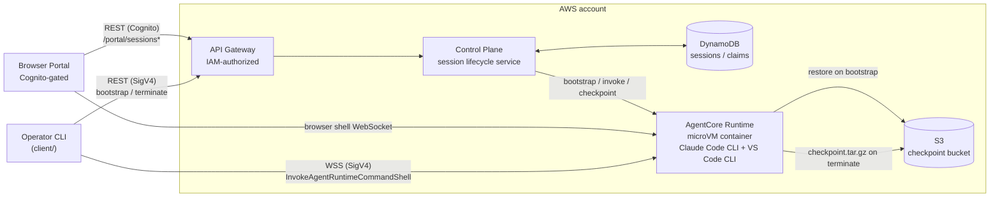

# Claude Code on Amazon Bedrock AgentCore Runtime

A private, governed Claude Code developer sandbox: each session provisions
an isolated [Amazon Bedrock AgentCore Runtime](https://docs.aws.amazon.com/bedrock/latest/userguide/agentcore.html)
microVM (Claude Code CLI + VS Code CLI pre-installed) behind an IAM-authorized
API, with an interactive shell and S3-backed checkpoint/restore so a
workspace survives across sessions.

This is a sibling to
[`claude-code-on-lambda-microvm`](../claude-code-on-lambda-microvm): same
governed developer-sandbox architecture and API shape, but running on
AgentCore Runtime (microVM compute type) instead of Lambda MicroVMs. See that
sample's README for a longer discussion of the underlying access-pattern
tradeoffs; this README only covers what's specific to the AgentCore Runtime
implementation.

## Architecture



## What gets deployed

- a VPC, KMS key, S3 checkpoint bucket, and DynamoDB sessions/claims tables;
- a private, IAM-authorized API Gateway backed by the control-plane Lambda;
- an `AWS::BedrockAgentCore::Runtime` running the `agent-runtime/` container
  image (Claude Code CLI + VS Code CLI);
- optionally (`enablePortal`, **on by default**), a Cognito user pool and a
  small portal Lambda that serves a single-page browser terminal behind a
  Cognito user pool authorizer.

## Prerequisites

- Node.js 22+, Docker (for the container image build/push), and the AWS CDK
  CLI (`npx cdk`, bundled via `devDependencies`).
- An AWS account/region with access to the AgentCore Runtime service and the
  Bedrock model configured in `bedrockModelId`.
- An AWS CLI profile with permission to deploy the stack, push to ECR, and
  (for the portal) manage the Cognito user pool.

## Quick start

Install and validate:

```bash
npm ci
npm run build
npm test
```

Copy and edit the deployment configuration:

```bash
cp deployment.example.json deployment.json
```

At minimum, review `region`, `vpcCidr`, `trustedClientCidr` (the CIDR allowed
to reach the private API), `bedrockModelId`, and `enablePortal`.

Deploy (builds/pushes the container image, then `cdk deploy`s the stack):

```bash
npm run deploy -- --config deployment.json --profile <profile> --require-approval never
```

Confirm the container is healthy without going through the control-plane API
or the portal:

```bash
npm run smoke-test -- --profile <profile> --region <region>
```

## Portal setup and first login

`enablePortal` defaults to `true`. When the stack finishes deploying, read
the `PortalUrl` and `PortalUserPoolId` outputs:

```bash
aws cloudformation describe-stacks \
  --stack-name ClaudeAgentCoreRuntimeStack \
  --profile <profile> --region <region> \
  --query "Stacks[0].Outputs"
```

The portal's Cognito user pool has **self-signup disabled** — there's no
public signup page, by design. Create the first user yourself:

```bash
aws cognito-idp admin-create-user \
  --user-pool-id <PortalUserPoolId> \
  --username '<user@example.com>' \
  --user-attributes \
    Name=email,Value='<user@example.com>' \
    Name=email_verified,Value=true \
  --region <region> \
  --profile <profile>
```

Cognito emails a temporary password and requires setting a new one at first
sign-in (password policy: 12+ characters, upper/lower/digit/symbol). To skip
email delivery and set the temporary password yourself instead, add
`--message-action SUPPRESS --temporary-password '<TempPassw0rd!>'` to the
command above — you're still forced to change it on first sign-in.

To log in:

1. Open the `PortalUrl` from the stack outputs.
2. Choose **Sign in** and complete the Cognito hosted UI flow (temporary
   password, then a new permanent password on first login).
3. Back on the portal, choose **Create environment**, name a workspace, and
   wait for it to reach `RUNNING`.
4. Choose **Connect** to open the terminal in the browser. From
   `/workspace`, run `claude`.

The portal only exposes terminal access (`accessMode: "terminal"`). VS Code
access and other lifecycle operations (`suspend`, `resume`, JSON output) are
available through the operator CLI — see below.

Only the `/portal/*` static asset routes (the SPA shell) are unauthenticated;
every route that touches session or workspace data requires either the
Cognito authorizer (portal) or SigV4/IAM (CLI).

## Operator CLI

```bash
npm run client -- --profile <profile> --region <region> start
```

`start` creates or reuses a terminal session and attaches. `list`, `status`,
`suspend`, `resume`, and `terminate` manage sessions from the same IAM
principal. Run `npm run client -- --help` for the full command reference.

## Lifecycle and checkpointing

AgentCore Runtime has no native pause primitive and no session
list/describe API, so `control-plane/` emulates suspend/resume itself:
`terminate` checkpoints `/workspace` to S3 as a `.tar.gz`, and the next
`start`/`resume` for the same workspace restores it. Sessions are
checkpoint-terminated automatically after `idleAfterSeconds` of shell
inactivity (default 900s), and hit an 8h hard cap regardless of activity.
The interactive shell connection itself has a 1h TTL — the CLI and portal
both reconnect automatically.

## Security and limitations

- The API is private and IAM-authorized by default; the portal path adds a
  Cognito user pool authorizer on top, scoped to `/portal/sessions*`. Static
  portal assets (HTML/JS/CSS/`config.json`) are intentionally public, since
  a browser needs to load them before it has a Cognito token.
- `cdk-nag` (AwsSolutions) is clean with documented suppressions in
  `infra/lib/nag-acks.ts`, including the portal-specific ones (Cognito
  advanced-security tier, MFA, and the public static-asset routes above).
- Advanced security features and MFA on the Cognito user pool are deferred
  to production hardening, matching the baseline-cost posture of the rest of
  the sample.
